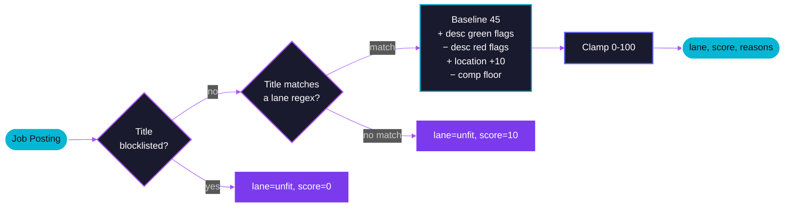

<p align="center">
  
</p>

<div align="center">


<br/>

[](https://metaventionsai.com)
[](https://github.com/Dicoangelo)
[](LICENSE)
[](https://docs.claude.com/en/docs/claude-code)

<br/>


<br/><br/>


<br/>

*One concrete top pick a day. Not a wall of options.*

</div>


<br/>

## The Loop

<div align="center">

```
┌────────────────────────────────────────────────────────────────────────────────┐
│                              JOB-RADAR DAILY LOOP                              │
├────────────────────────────────────────────────────────────────────────────────┤
│                                                                                │
│   DISCOVER          →          SCORE             →         RANK               │
│   ATS scrapers                  lane regex                  warm-line          │
│   LinkedIn alerts               blocklist                   visa (opt)         │
│   Firecrawl search              comp floor                  history-aware      │
│                                                                                │
│   ════════════════════════════════════════════════════════════════════════════ │
│                                                                                │
│   • Free Premium replacement          • Same scoring brain across sources     │
│   • Direct ATS routing                • SQLite local, your data               │
│   • Warm-line graph capture           • Idempotent re-runs                    │
│                                                                                │
└────────────────────────────────────────────────────────────────────────────────┘
```

</div>

<br/>


<br/>

## System Architecture

```mermaid
%%{init: {'theme': 'dark', 'themeVariables': { 'primaryColor': '#06b6d4', 'primaryTextColor': '#fff', 'primaryBorderColor': '#06b6d4', 'lineColor': '#a855f7', 'secondaryColor': '#1a1a2e', 'tertiaryColor': '#0d1117', 'clusterBkg': '#0d1117', 'clusterBorder': '#06b6d4'}}}%%
flowchart TB
    subgraph PLATFORM["JOB-RADAR PLATFORM"]
        direction TB

        subgraph SKILLS["CLAUDE CODE SKILLS — ~/.claude/commands/"]
            direction LR
            RADAR["/job-radar<br/>━━━━━━━━━━<br/>Daily ATS scan<br/>Top pick + 3 backups"]
            LINKEDIN["/job-radar-linkedin<br/>━━━━━━━━━━<br/>Gmail alert ingest<br/>Warm-line capture"]
            FIRECRAWL["/job-radar-firecrawl<br/>━━━━━━━━━━<br/>Paid broad-web<br/>10-15 credits/run"]
            WARMLINE["/warm-line<br/>━━━━━━━━━━<br/>Tier 1-4 outreach<br/>Pre-apply leverage"]
            APPLY["/apply<br/>━━━━━━━━━━<br/>JD → render → submit<br/>Browser MCP"]
        end

        subgraph ENGINE["PYTHON ENGINE — ~/.job-radar/engine/"]
            direction LR
            CONFIG["profile.yml<br/>━━━━━━━━━━<br/>lanes, blocklist<br/>comp floor, targets"]
            SCORER["scorer.py<br/>━━━━━━━━━━<br/>Title-first classify<br/>0-100 score"]
            DISCOVER["discover.py<br/>━━━━━━━━━━<br/>ATS scrapers<br/>3 adapters"]
            BRIEFING["briefing.py<br/>━━━━━━━━━━<br/>One-screen report<br/>History-aware"]
            INGEST["linkedin_ingest.py<br/>━━━━━━━━━━<br/>Subject parser<br/>Idempotent dedup"]
        end

        subgraph ATS["ATS ADAPTERS"]
            direction LR
            GH["Greenhouse<br/>━━━━━━━━━━<br/>boards-api.greenhouse.io<br/>No auth"]
            LV["Lever<br/>━━━━━━━━━━<br/>api.lever.co<br/>No auth"]
            AS["Ashby<br/>━━━━━━━━━━<br/>api.ashbyhq.com<br/>No auth"]
        end

        subgraph DATA["DATA LAYER — ~/.job-radar/"]
            DB[("radar.db<br/>━━━━━━━━━━<br/>SQLite + WAL<br/>6 tables, local")]
            BRIEFINGS["briefings/<br/>━━━━━━━━━━<br/>YYYY-MM-DD.md<br/>audit trail"]
            VISA["visa/lca.db<br/>━━━━━━━━━━<br/>OPTIONAL<br/>H-1B annotation"]
        end
    end

    OPERATOR(("OPERATOR"))
    GMAIL["Gmail MCP<br/>(LinkedIn alerts)"]

    OPERATOR <==>|"Claude Code CLI"| RADAR
    OPERATOR <==>|"Claude Code CLI"| LINKEDIN
    OPERATOR <==>|"Claude Code CLI"| WARMLINE
    OPERATOR <==>|"Claude Code CLI"| APPLY
    LINKEDIN -.->|"subject parse"| GMAIL
    RADAR --> DISCOVER
    RADAR --> BRIEFING
    LINKEDIN --> INGEST
    DISCOVER --> ATS
    DISCOVER --> SCORER
    INGEST --> SCORER
    SCORER --> CONFIG
    DISCOVER -.->|"writes"| DB
    INGEST -.->|"writes"| DB
    BRIEFING -.->|"reads"| DB
    BRIEFING -.->|"writes"| BRIEFINGS
    WARMLINE -.->|"reads/writes"| DB
    APPLY -.->|"reads/writes"| DB
    APPLY -.->|"opt"| VISA

    style PLATFORM fill:#0d1117,stroke:#06b6d4,stroke-width:3px
    style SKILLS fill:#1a1a2e,stroke:#06b6d4,stroke-width:2px
    style ENGINE fill:#1a1a2e,stroke:#a855f7,stroke-width:2px
    style ATS fill:#1a1a2e,stroke:#8b5cf6,stroke-width:2px
    style DATA fill:#16213e,stroke:#06b6d4,stroke-width:2px
    style OPERATOR fill:#06b6d4,stroke:#fff,stroke-width:2px,color:#0d1117
    style GMAIL fill:#a855f7,stroke:#fff,stroke-width:2px,color:#fff
```

<div align="center">



<sub>Five skills, one engine, one SQLite file. Your data stays local.</sub>

</div>

<br/>


<br/>

## The Five Skills

<table>
<tr>
<td width="20%" align="center" valign="top">
<h3>/job-radar</h3>
<b>Daily ATS scan</b>
<p>Scrapes target companies, scores against your lane regex, outputs one top pick + 3 backups. No wall of options.</p>
</td>
<td width="20%" align="center" valign="top">
<h3>/job-radar-linkedin</h3>
<b>Free Premium replacement</b>
<p>Ingests LinkedIn job-alert emails from Gmail, parses subject-line cards, auto-captures warm-line connections.</p>
</td>
<td width="20%" align="center" valign="top">
<h3>/job-radar-firecrawl</h3>
<b>Broad-web discovery</b>
<p>Paid variant using Firecrawl search across the live web. Same scoring brain. 10-15 credits per run.</p>
</td>
<td width="20%" align="center" valign="top">
<h3>/warm-line</h3>
<b>Pre-apply leverage</b>
<p>Surfaces Tier 1-4 connections, drafts ready-to-paste outreach, halts cold-applies when ATS dedup risk exists.</p>
</td>
<td width="20%" align="center" valign="top">
<h3>/apply</h3>
<b>End-to-end submit</b>
<p>JD URL to confirmation. WebFetch the JD, tailor resume + cover, render to PDF, browser-MCP submit through Greenhouse / Lever / Ashby.</p>
</td>
</tr>
</table>

<br/>

## Why this exists

<div align="center">

| | Default flow | Job-radar flow |
|---|---|---|
| **Discovery** | Open LinkedIn, scroll, refresh | Five sources auto-scanned daily |
| **Filtering** | Eye-balling titles | Title regex + blocklist + comp floor |
| **Ranking** | Most recent first | Lane fit + warm-line + history-aware |
| **Warm-line** | Forgotten until after applying | Mandatory pre-apply check, drafts ready |
| **Submission** | Manual paste, ~80 tool calls | ~35 tool calls, browser-automated |
| **Persistence** | Tabs and screenshots | SQLite, your data, your machine |

</div>

<br/>

## Quickstart

```bash
# 1. Clone
git clone https://github.com/Dicoangelo/job-radar-production.git
cd job-radar-production

# 2. Install (sets up ~/.job-radar/, copies skills to ~/.claude/commands/)
bash install.sh

# 3. Pick a starter profile and edit it
cp examples/profile.revops.yml ~/.job-radar/profile.yml
$EDITOR ~/.job-radar/profile.yml

# 4. Restart Claude Code, then in any project:
/job-radar
```

That's the whole loop. Skills auto-discover the profile at `~/.job-radar/profile.yml`. The DB initializes on first run.

<br/>

## Project Structure

```
job-radar-production/
├── README.md                       ← this file
├── LICENSE                         ← MIT
├── install.sh                      ← idempotent installer
├── profile.example.yml             ← annotated full schema reference
├── skills/                         ← the 5 Claude Code skills
│   ├── job-radar.md
│   ├── job-radar-linkedin.md
│   ├── job-radar-firecrawl.md
│   ├── warm-line.md
│   └── apply.md
├── engine/                         ← Python engine, ~1500 LOC
│   ├── config.py                   ← profile.yml loader
│   ├── scorer.py                   ← config-driven lane scorer
│   ├── discover.py                 ← ATS pipeline orchestrator
│   ├── briefing.py                 ← daily one-screen report
│   ├── linkedin_ingest.py          ← Gmail alert → DB
│   ├── db.py                       ← SQLite connection helper
│   ├── schema.sql                  ← 6-table schema
│   └── adapters/
│       ├── greenhouse.py           ← boards-api.greenhouse.io
│       ├── lever.py                ← api.lever.co
│       └── ashby.py                ← api.ashbyhq.com
├── visa/                           ← OPTIONAL H-1B LCA annotation
│   └── lca_lookup.py
├── examples/                       ← starter profiles
│   ├── profile.revops.yml
│   ├── profile.partner-ops.yml
│   └── profile.generic.yml
└── demo/                           ← static showcase page
    └── index.html
```

<br/>

## Configuration: profile.yml

Everything is driven by one YAML file. Starter profiles cover common lanes:

<table>
<tr>
<td width="33%" align="center" valign="top">
<h3>profile.revops.yml</h3>
<b>Revenue Operations</b>
<p>IC / Manager track. SFDC, deal desk, GTM systems, pipeline hygiene. Comp floor $110K.</p>
</td>
<td width="33%" align="center" valign="top">
<h3>profile.partner-ops.yml</h3>
<b>Partner / Alliances</b>
<p>Cloud alliances, co-sell motion, deal registration, hyperscaler ecosystems. Comp floor $130K.</p>
</td>
<td width="33%" align="center" valign="top">
<h3>profile.generic.yml</h3>
<b>Scaffolding</b>
<p>Empty template with placeholder regex. Fill in your lane signals and target companies.</p>
</td>
</tr>
</table>

Inside any profile:

```yaml
lanes:                    # role families you'd take
  revops:
    title_signals:        # regex patterns matching role titles
    desc_boosts:          # phrases that reinforce a match

title_blocklist: [...]    # roles you'd never take (regex)

description_red_flags: [...]   # JD signals that penalize (10+ yrs, clearance)
description_green_flags: [...] # JD signals that boost (remote, 3-5 yrs)

location_whitelist: [...]      # what counts as a fit
location_blacklist: [...]      # drop entirely

comp_floor: { amount: 110000, currency: USD }

visa:
  enabled: false                # most users: leave off
  status: citizen               # citizen | tn | h1b | o1

targets:                        # companies whose ATS to scrape
  - { name: Stripe, ats_type: greenhouse, ats_slug: stripe, ... }
```

See [`profile.example.yml`](profile.example.yml) for the full annotated schema.

<br/>

## How the Scorer Works

<div align="center">



</div>

1. **Title-first classification.** A posting's title must match a lane's `title_signals` regex. No match = `unfit`.
2. **Blocklist check.** Any posting matching `title_blocklist` is dropped to `unfit` regardless of other signals.
3. **Baseline of 45** for a lane match.
4. **Description scan** applies green/red flag deltas from your profile.
5. **Location scan** boosts (+10) for whitelist, penalizes (-8) for off-whitelist, drops (-100) for blacklist.
6. **Comp floor scan** penalizes if posted comp is below your floor.
7. Final score clamped to 0-100. Shortlist threshold (default 60) gates the briefing output.

All 150 lines of this logic live in [`engine/scorer.py`](engine/scorer.py).

<br/>

## Database

One SQLite file at `~/.job-radar/radar.db`. Six tables:

<div align="center">

| Table | What it holds |
|---|---|
| `target_companies` | Seeded from `profile.targets` on first run |
| `job_postings` | All discovered postings, deduped by `(company, external_id, source)` |
| `applications` | Your submitted apps (logged manually or via `/apply`) |
| `contacts` | Warm-line graph |
| `outreach` | Every drafted/sent DM, recruiter email, referral |
| `radar_runs` | Run history |

</div>

Schema is plain SQL in [`engine/schema.sql`](engine/schema.sql). Backup is `cp ~/.job-radar/radar.db ~/Desktop/radar-backup.db`.

<br/>

## Daily Loop

```bash
/loop 24h /job-radar           # daily ATS scan + one pick
/loop 24h /job-radar-linkedin  # ingest LinkedIn alerts (free, no Premium needed)
```

Output is one screen per run. Briefings persist at `~/.job-radar/briefings/YYYY-MM-DD.md` for audit.

<br/>

## The Visa Module (optional)

Most users are citizens or permanent residents and ignore this. If you need work auth in a country where you aren't a citizen (TN, H-1B, O-1), set `profile.visa.enabled: true` and the scorer annotates companies with LCA filing counts.

Build the LCA database once from DOL's public H-1B disclosure data:

```bash
# https://www.dol.gov/agencies/eta/foreign-labor/performance
python3 visa/build_lca_db.py H-1B_Disclosure_Data_FYxxxx.csv
```

The visa module never runs for citizens / PRs. Clean opt-in.

<br/>

## Tuning Your Scoring (the actual moat)

The skeleton is generic. The **value** is in the lane regex you write and the green/red flags you add. Start with the closest example profile, run it for a week, then:

- Roles you'd take that surfaced as `unfit`? Lane regex too narrow. Add a pattern.
- Roles that scored high but you'd skip? Add to `title_blocklist` or `description_red_flags`.
- Companies that keep showing in shortlist but ghost you? Bump their `applications` row to `ghosted` — the briefing's history-aware shortlist deprioritizes them.

The starter profiles ship with sane defaults. Your live profile is where YOUR learnings accumulate.

<br/>

## Claude.ai (web/desktop) fallback

Built for Claude Code (CLI). On Claude.ai web/desktop:

1. The Python engine runs locally regardless:
   ```bash
   python3 ~/.job-radar/engine/discover.py        # scan ATS
   python3 ~/.job-radar/engine/briefing.py        # generate briefing
   ```
2. Paste the briefing into a Claude.ai project as knowledge.
3. Use any skill file's body as the system prompt.

Browser-automation parts of `/apply` need MCP tools that only Claude Code has — the rest works as paste-the-briefing-and-discuss.

<br/>

<details>
<summary><b>Roadmap</b></summary>

- [ ] More ATS adapters (Workable, SmartRecruiters, Rippling)
- [ ] JD-keyword extractor v2 (Claude-driven, not regex)
- [ ] Optional Supabase sync for cross-device access
- [ ] Dashboard view (HTML, served from `~/.job-radar/`)
- [ ] More starter profiles (PM, Marketing, Eng, Customer Success)
- [ ] Auto-tune lane regex from `applications` outcomes (rejected vs offered)

PRs welcome. Codebase is intentionally readable: < 1500 lines Python + 5 markdown skills.

</details>

<details>
<summary><b>Uninstall</b></summary>

```bash
bash install.sh --uninstall
```

Removes `~/.job-radar/` and the five skills from `~/.claude/commands/`. Your profile is backed up to `~/job-radar-profile.backup.yml`.

</details>

<details>
<summary><b>What this doesn't do</b></summary>

- **DOCX render** — `/apply` ships PDF only. Most modern ATS accept PDF.
- **Workday adapter** — Workday is opaque per-tenant. Use `/job-radar-firecrawl` for those.
- **Mobile** — Claude Code is desktop-first.
- **Multi-user / hosted** — single-user, self-hosted by design. Your data stays local.

</details>

<br/>


<br/>

## Credits

<div align="center">

Built and battle-tested by [**Dico Angelo**](https://dicoangelo.metaventionsai.com).<br/>
Productized so anyone can run the loop without rebuilding the toolchain.

Part of the [**Metaventions AI**](https://metaventionsai.com) ecosystem.<br/>
Sovereign agent infrastructure for individuals.

<br/>

[](https://github.com/Dicoangelo/job-radar-production)
[](https://github.com/Dicoangelo)

</div>

<br/>

<p align="center">
  
</p>
